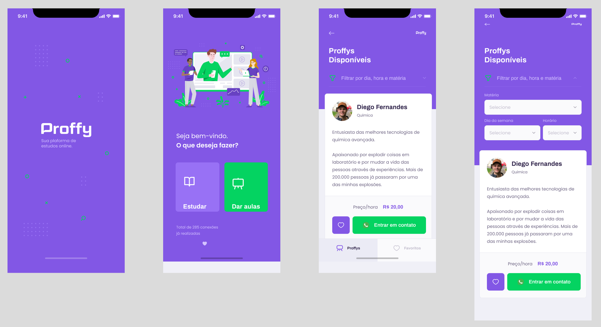
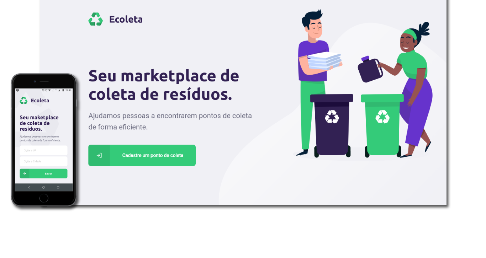
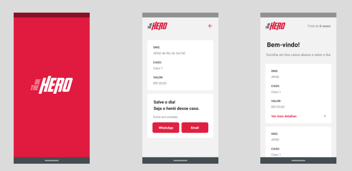

  <h1 >
    Projetos dos eventos gratuitos da Rocketseat
  </h1>

  

## Sobre a Rocketseat

A  [Rocketseat](https://blog.rocketseat.com.br) é
uma plataforma com metodologia prática, comunidade, eventos e conteúdos gratuitos que permitem uma conexão com o mercado de trabalho, o que ajuda programadores novatos a encontrar uma direção além de ajudar os experientes a adquirir novas habilidades e melhorar as já existentes. Alguns eventos são o OmniStack e o Next Level Week, cada evento é realizado durante uma semana, explorando tecnologias como Node.js, React, Native dentre outras. A seguir, alguns projetos de alguns edições desses eventos.

 

---
##  Projetos desenvolvidos
* [Plantmanager - Next Level Week 5](#plantmanager)   |   [  Ver repositório](https://github.com/andersonzeroone/plantmanager-Nlw05)   
* [Happy - Next Level Week 3](#happy)   |   [  Ver repositório](https://github.com/andersonzeroone/Happay-Nlw)         
* [Proff - Next Level Week 2](#proff)   |   [  Ver repositório](https://github.com/andersonzeroone/Proff-Nlw)   
* [Ecoleta - Next Level Week 1](#ecoleta)   |   [  Ver repositório](https://github.com/andersonzeroone/Ecoleta-NLW)   
* [Be The Hero OmniStack](#be-the-hero) |   [  Ver repositório](https://github.com/andersonzeroone/beTheHero-OmniStack11)   

---

## Plantmanager

Plant Manager é um aplicativo que ajuda a lembrar de regar e acompanhar suas plantas.

[Ver repositório](https://github.com/andersonzeroone/plantmanager-Nlw05)

  

 

---
## Happy

O sistema Happay na versão web e mobile permite que as pessoas possam localizar orfanatos próximos ou em outros estados, e levar mais sorrisos para as crianças.

[Ver repositório](https://github.com/andersonzeroone/Happay-Nlw)

  

 

----
## Proff

Em meio a pandemia muitas áreas sofrem mudanças extrema e a educação foi uma delas que mais sofrem mudanças como a forma de realizar as aulas e o contato com professores. O sistema Proffy, permite você encontrar diversos professores on-line, que oferecem aulas particulares e com horários flexíveis servindo como um reformo em meio a pandemia.

[Ver repositório](https://github.com/andersonzeroone/Proff-Nlw)

  

 

----

## Ecoleta

Ecoleta é um sistema que ajuda a encontrar empresas ou outras pessoas que fazem o descarte adequado de resíduos orgânicos e não orgânicos.

[Ver repositório](https://github.com/andersonzeroone/Ecoleta-NLW)

  

 

----
## Be the hero

Be The Hero é uma plataforma que ajuda Ongs a encontrar pessoas que estão dispostas a ajudar em algumas situações. Basta o usuário cadastrar a Ongs em seguida cadastrar algum caso que precisa de ajuda, seja uma ajuda financeira ou mão de obra.

[Ver repositório](https://github.com/andersonzeroone/beTheHero-OmniStack11)
 

  

 

----
##  Autor
 

<a href="https://github.com/andersonzeroone">
 
  
  
 <b>Anderson Pablo</b></a> <a href="https://www.linkedin.com/in/anderson-pablo-js/" title="andersonPablo">🚀</a>
  

  

---

## Licença

Este projeto esta sobe a licença [MIT](./LICENSE).

Feito com ❤️ por Anderson Pablo 👋🏽 [Entre em contato!](https://www.linkedin.com/in/anderson-pablo-js/)

---

<!-- ##  Versões do README

[Português 🇧🇷](./README.md)  |  [Inglês sem emojis 🇺🇸](./README-en.md) | [Portugues sem logo  🇧🇷](./README-sem-logo.md)  -->